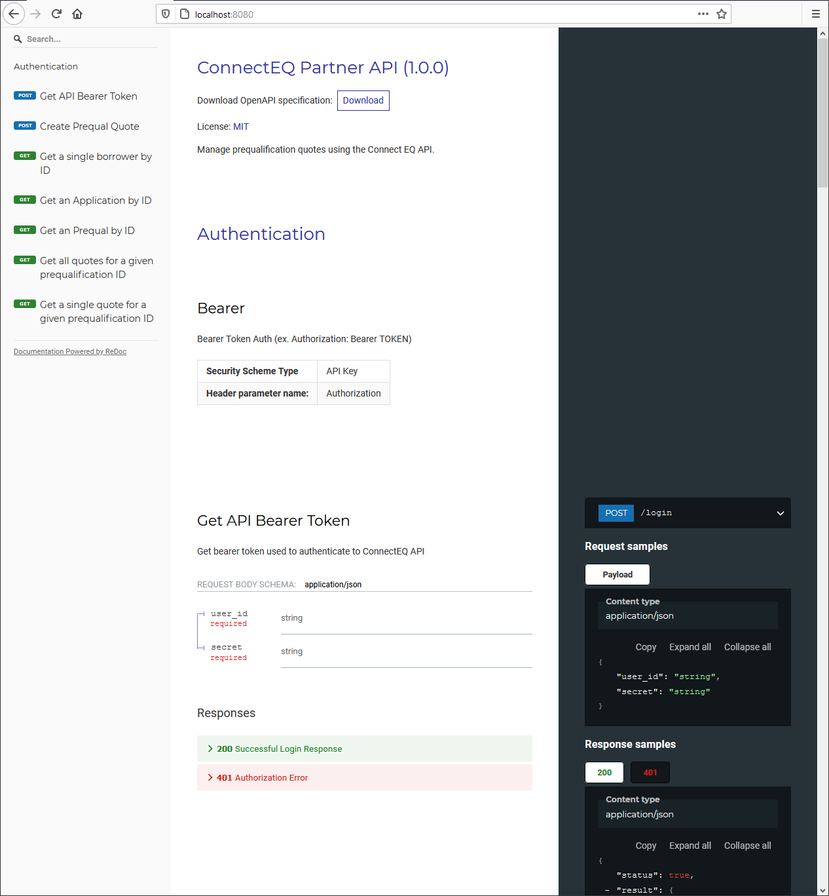
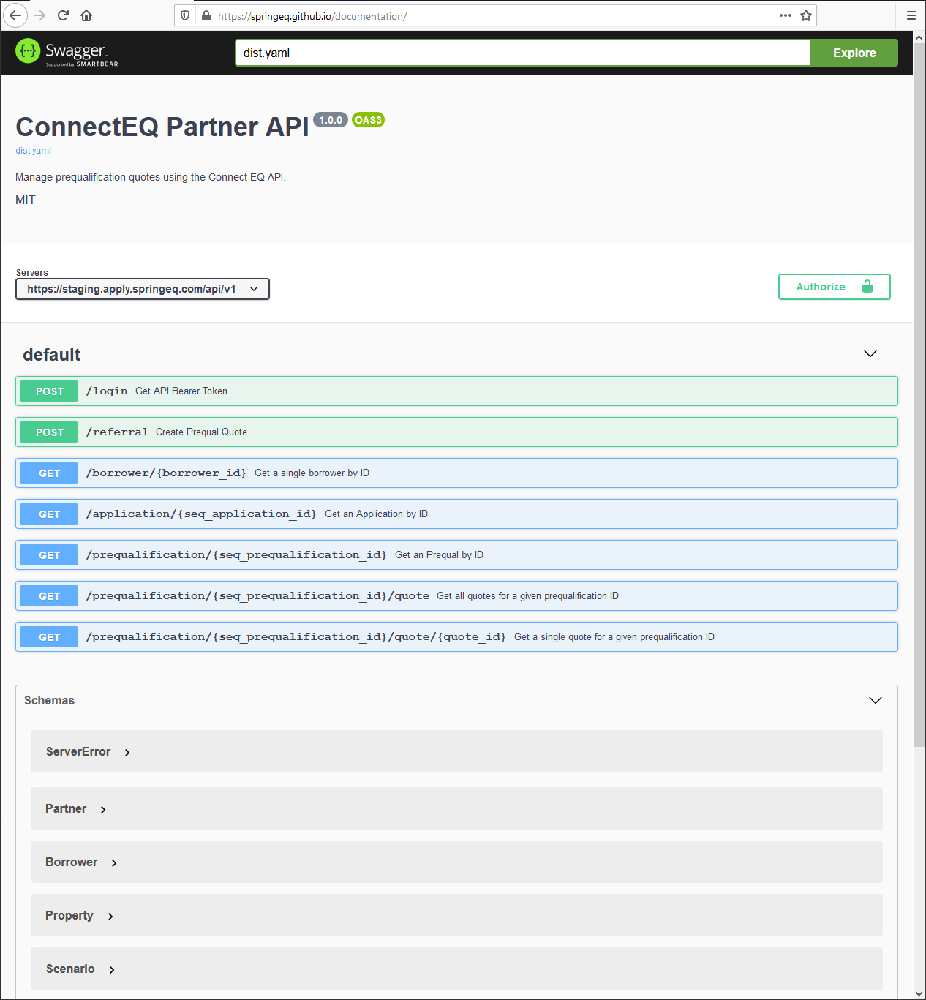

# ConnectEQ API

https://springeq.github.io/documentation/

This is Spring EQ's documentation repository for partner API's called "ConnectEQ". 

## Development Details
Documentation is available as OpenAPI 3.0 via Swagger UI, served by GitHub Pages.

This repository was generated using [create-openapi-repo](https://github.com/Redocly/create-openapi-repo), which uses [redoc](https://github.com/Redocly/redoc) for development purposes.

Static serving of Swagger UI is implemented as detailed by https://github.com/peter-evans/swagger-github-pages.

### How to make & publish changes

1. `npm run start`
2. `npm run test`
3. Update semver
4. `npm run build`
5. Create PR
6. Merge PR

#### Explanation

1. `npm run start` - this will start a server in watch mode for you to preview the OpenAPI spec in the Redoc format (localhost:8080)

2. `npm run test` - this will run an OpenAPI linter to validate the spec

3. Update the version of the spec following semantic versioning rules

4. `npm run build` - this will generate the final combined documentation to be served (defaults to `dist.yaml` in the project root)

5. Make a pull request, including the compiled `dist.yaml`

6. Merge and verify your changes at https://springeq.github.io/documentation/

